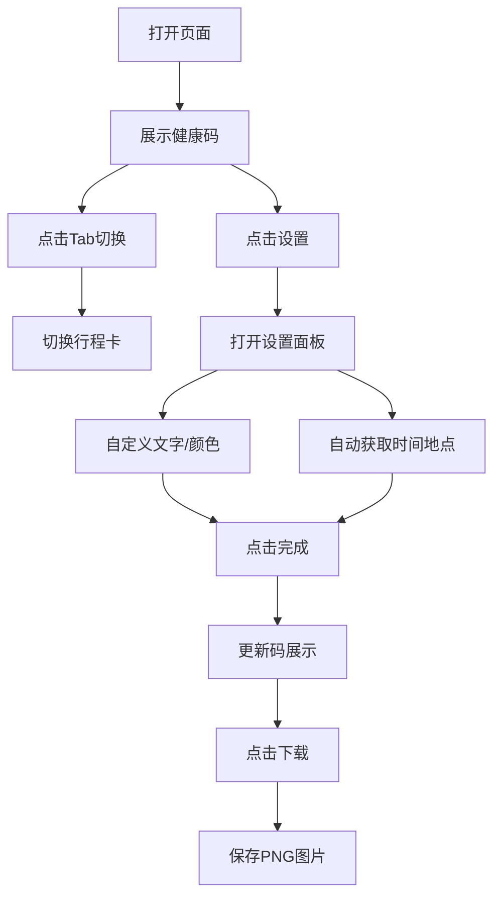

## 1. 产品概述

健康码与行程卡纪念版 Web 应用，提供可自定义的健康码和行程卡生成功能，支持自动获取时间和地理位置，颜色自定义，以及图片保存下载。纯前端静态页面，可通过 GitHub Pages 等静态托管服务部署。

- 主要用途：纪念和娱乐用途，生成个性化的健康码/行程卡图片
- 目标用户：对疫情时代有纪念需求的普通用户
- 核心价值：提供简单易用的自定义码生成工具，支持一键下载保存

## 2. 核心功能

### 2.1 用户角色
| 角色 | 注册方式 | 核心权限 |
|------|----------|----------|
| 普通用户 | 无需注册 | 生成、自定义、下载健康码/行程卡 |

### 2.2 功能模块
1. **首页**：健康码展示、行程卡展示、Tab切换
2. **设置面板**：自定义文字内容、颜色选择、地点设置
3. **图片下载**：一键保存为PNG图片

### 2.3 页面详情
| 页面名称 | 模块名称 | 功能描述 |
|-----------|-------------|---------------------|
| 首页 | 码展示区 | 展示健康码/行程卡卡片，支持切换两种码类型 |
| 首页 | Tab切换 | 健康码/行程卡切换按钮，平滑过渡动画 |
| 首页 | 设置按钮 | 打开设置面板，支持自定义各项内容 |
| 首页 | 下载按钮 | 将当前码保存为PNG图片下载 |
| 设置面板 | 文字设置 | 自定义标题、姓名、时间、地点等文字内容 |
| 设置面板 | 颜色设置 | 预设绿/黄/红三色，支持自定义颜色选择器 |
| 设置面板 | 自动获取 | 一键获取当前时间和地理位置 |

## 3. 核心流程

用户打开页面 → 默认展示健康码 → 点击设置按钮打开面板 → 自定义内容/颜色 → 点击完成关闭面板 → 点击下载按钮保存图片

## 4. 用户界面设计

### 4.1 设计风格
- 主色调：绿色（健康码）/ 可自定义
- 按钮风格：圆角按钮，悬停有缩放和阴影效果
- 字体：现代无衬线字体，清晰易读
- 布局：居中卡片式布局，移动端优先
- 图标风格：简洁线性图标

### 4.2 页面设计概述
| 页面名称 | 模块名称 | UI元素 |
|-----------|-------------|-------------|
| 首页 | 码展示区 | 圆角卡片、渐变背景、二维码样式、状态文字 |
| 首页 | Tab切换 | 底部/顶部切换栏、滑动指示器 |
| 设置面板 | 表单区域 | 输入框、颜色选择器、开关按钮 |
| 设置面板 | 操作按钮 | 完成按钮、重置按钮 |

### 4.3 响应性
- 移动端优先设计，适配手机屏幕
- 桌面端居中展示，最大宽度限制
- 触控友好，按钮尺寸适合手指点击

### 4.4 动画效果
- 页面入场渐现动画
- Tab切换平滑过渡
- 设置面板滑入滑出
- 按钮悬停/点击微交互
