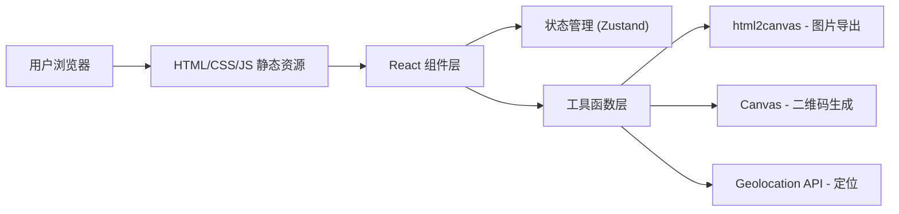

## 1. 架构设计

纯前端静态页面架构，无后端服务，所有功能在浏览器端完成。支持通过 GitHub Pages 等静态托管服务部署。



## 2. 技术描述

- **前端框架**: React 18 + TypeScript
- **构建工具**: Vite
- **样式方案**: Tailwind CSS 3
- **状态管理**: Zustand
- **动画库**: GSAP + @gsap/react
- **图标库**: @phosphor-icons/react
- **图片导出**: html2canvas
- **二维码**: qrcode.react 或纯 Canvas 实现
- **部署方式**: GitHub Pages 静态托管

## 3. 项目结构

```
src/
├── components/          # 组件目录
│   ├── HealthCode.tsx   # 健康码组件
│   ├── TravelCard.tsx   # 行程卡组件
│   ├── SettingsPanel.tsx # 设置面板组件
│   ├── TabSwitcher.tsx  # Tab切换组件
│   └── ColorPicker.tsx  # 颜色选择器组件
├── hooks/               # 自定义Hooks
│   ├── useLocation.ts   # 获取地理位置
│   └── useTime.ts       # 获取当前时间
├── store/               # 状态管理
│   └── useCardStore.ts  # 卡片状态
├── utils/               # 工具函数
│   ├── downloadImage.ts # 图片下载工具
│   └── colors.ts        # 颜色工具函数
├── App.tsx              # 主应用组件
├── main.tsx             # 入口文件
└── index.css            # 全局样式
```

## 4. 状态管理设计

```typescript
// 卡片类型
type CardType = 'health' | 'travel';

// 健康码状态
interface HealthCodeState {
  title: string;
  subtitle: string;
  name: string;
  time: string;
  location: string;
  status: 'green' | 'yellow' | 'red' | 'custom';
  customColor: string;
}

// 行程卡状态
interface TravelCardState {
  title: string;
  subtitle: string;
  phone: string;
  time: string;
  timeSpan: string;
  location: string;
  status: 'green' | 'yellow' | 'red' | 'custom';
  customColor: string;
}
```

## 5. 核心功能实现方案

### 5.1 自动获取时间
- 使用 `Date` 对象实时获取当前时间
- 格式化显示为 `YYYY.MM.DD HH:mm:ss` 格式
- 每秒自动更新

### 5.2 自动获取地点
- 使用浏览器 `Geolocation API` 获取经纬度
- 通过第三方逆地理编码API转换为地址（可选）
- 支持用户手动输入地点

### 5.3 颜色自定义
- 预设绿、黄、红三种状态色
- 提供颜色选择器支持任意自定义颜色
- 动态更新CSS变量实现主题切换

### 5.4 图片下载
- 使用 `html2canvas` 将DOM转换为Canvas
- 通过Canvas的 `toDataURL` 导出为PNG
- 创建临时 `<a>` 标签触发下载

### 5.5 动画效果
- 使用 GSAP 实现页面入场动画
- Tab切换使用平滑过渡动画
- 设置面板滑入滑出效果
- 按钮悬停和点击微交互
